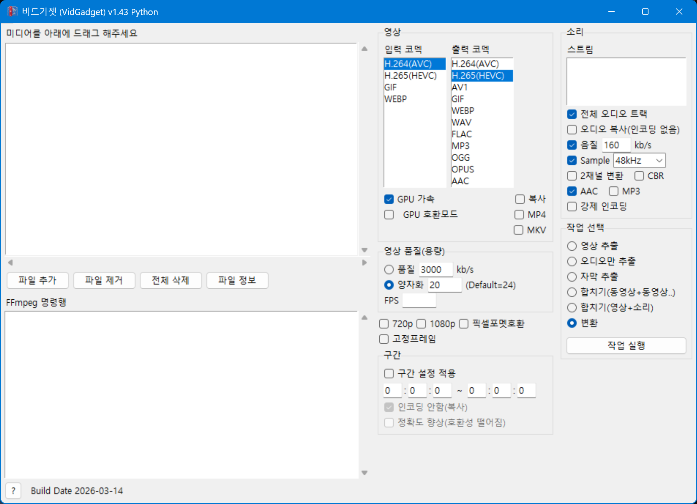

# VidGadget



FFmpeg 기반 비디오/오디오 변환 GUI 도구 (Python/Tkinter)

## 주요 기능

- **비디오 변환**: H.264, H.265(HEVC), AV1, GIF, WEBP 등
- **오디오 변환**: MP3, AAC, OGG, OPUS, WAV, FLAC 등
- **추출**: 동영상에서 영상만 또는 소리만 추출
- **합치기**: 여러 동영상 합치기, 영상+소리 합치기
- **구간 편집**: 특정 구간만 추출
- **GPU 가속**: NVIDIA NVENC 지원
- **해상도 변경**: 720p, 1080p 등

## 요구사항

- Python 3.8+
- FFmpeg (PATH에 등록 또는 같은 폴더에 위치)


## 설치

### Python 다운로드 및 설치

공식 사이트에서 다운로드:
- https://www.python.org/downloads/
- 설치 시 **"Add Python to PATH"** 체크 필수

설치 확인:
```bash
python --version
```

### FFmpeg 다운로드 및 설치

공식 사이트에서 다운로드:
- https://ffmpeg.org/download.html
- Windows 빌드: https://www.gyan.dev/ffmpeg/builds/ 에서 `ffmpeg-release-essentials.zip` 다운로드

설치 방법:
1. 압축 해제 후 `bin` 폴더 안의 `ffmpeg.exe`를 vidGadget 폴더에 복사하거나
2. `bin` 폴더 경로를 시스템 환경변수 PATH에 추가

설치 확인:
```bash
ffmpeg -version
```

### scoop을 이용한 설치 (대안)

윈도우 패키지 관리자 scoop을 사용하면 Python과 FFmpeg를 간편하게 설치할 수 있습니다.

- scoop 설치 (powershell 실행)
```powershell
Set-ExecutionPolicy RemoteSigned -Scope CurrentUser
Invoke-RestMethod -Uri 'https://get.scoop.sh' | Invoke-Expression
```

cmd.exe 에서 한줄 명령:
```cmd
powershell -Command "Set-ExecutionPolicy RemoteSigned -Scope CurrentUser; Invoke-RestMethod -Uri 'https://get.scoop.sh' | Invoke-Expression"
```

- Python 설치
```bash
scoop install git
scoop bucket add versions
scoop install python312
```

- FFmpeg 설치
```bash
scoop install ffmpeg
```

### Python 패키지 설치

```bash
pip install -r requirements.txt
```

## 실행
```
vidGadget.bat
```

## 사용법

1. "파일 추가" 또는 드래그 앤 드롭으로 파일 선택
2. 코덱, 품질, 해상도 등 옵션 설정
3. 작업 종류 선택 (변환, 추출, 합치기)
4. "작업 실행" 클릭

